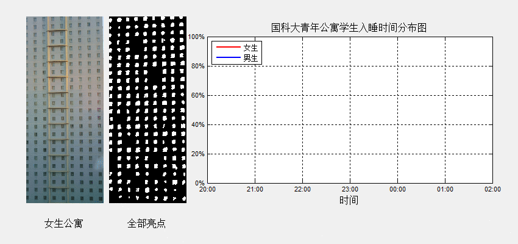

# 图像分析中科院在校生作息时间

# 最终效果

首先秀一下最终效果图。下图展示的是2015年10月12日晚至2015年10月13日凌晨国科大学生的入睡情况。

# 设计动机
如果有一部四年前旧安卓机，你能拿它来做什么？压箱底，当锤子，还是挡子弹？这样的手机，扔到路上也不会有人捡吧。当然，如果你把它放到楼顶一个晚上也是安全的。现在你可以把它固定在公寓楼顶，对准对面的女生公寓，并开启自动拍照模式，嘿嘿嘿。。。

# 设计思路

你可能已对某个女神仰慕已久，无数次的回望她的那扇窗，可是旧手机的像素很差，并不能看清窗内发生了什么，但窗户的个数还是数的过来的。灯起灯灭，女神是几点休息的呢？通过数亮灯窗户的数量，我们可以得到此刻还未休息的女生户数。

借助二值图像，我们更容易的发现亮灯的窗户，但由于不同窗户亮度的差别，二值化阈值并不是很容易选取，阈值过低会使不同窗户连成一片，阈值过高会抹掉较暗的窗子（拉了窗帘），理想的效果是一扇窗户正好对应一个白色区域。由于同一扇窗户的不同部位明暗度也不同，为了减小方差，我们先对图像做一下平滑滤波。

上图我们看到，滤波直径为10px的时候二值图像效果是最好的。
现在原始图像已经被处理成规则的二值图像，你心仪女神入睡时间的计算方法是：如果她的窗户上一时刻是亮的，下一个时刻是暗的，则说明她关灯休息了。只需对比所有窗户相邻两个时刻的明暗情况，就能得到每户的入睡时间。
一个晚上你的手机拍摄了上百张照片（每隔5分钟拍一张，从晚上20:00拍到第二天早上6:00），手动去数这些图像上的亮点显然不现实，但是你可是学过C语言的，你的for循环呢？什么，你不懂图像处理，难道你不知道有个叫做MATLAB的计算器么，它的图像处理功能也很强大呢。上面所有的图像处理加一起，也没有超过6个MATLAB库函数（imread, imwrite, imfilter, graythresh, im2bw, regionprops），相信你能搞定的。
What!! 女神关灯之后并没有休息，还在寂寞难耐的扣手机呢，看来你的机会来啦！

更加详细的[设计思路在这里](./doc/分析设计.docx)

# 结果分析

通过上图可以看出国科大青年公寓的男生和女生们有着基本相同的作息时间。22:56蓝线和红线交汇，这是女生入睡比例开始高于男生比例的转折点，由于蓝线表示的是博士，蓝线位于下方似乎也佐证了博士比其他人更加卖力的事实。
22:01之前入睡的总人数只有10 %，23:01之前入睡的比例也只有24 %，00:01之前入睡的人为63.5%，01：01之前入睡的人为90%。从上图中的陡坡可以看出，入睡高峰从23:00左右开始，持续到00:30，有将近60%的在这个时间段内入睡。我们称这个时间段为“国科大青年公寓最佳入睡时间”。有3.6%的人02:02之后还没睡，这意味着这部分人通宵了。

从上图中可以看出，入睡高峰从23:00左右开始，持续到00:30。

从上图可以很明显的看出大家入睡的时间趋势，大多数人集中在在00:01左右大家迅速进入梦乡。

更加详细的数据说明在这里[国科大青年公寓学生入睡时刻统计报告](./doc/国科大青年公寓学生入睡时刻统计报告.docx)

# 代码和数据

图像处理使用的是Matlab，[代码在这里](./matlab_code)

手机拍摄的[原始图片在这里](./data_img)

# 特别建议

**个人觉得晚睡不足提倡，大家还是早睡早起的好，不要等到身体被掏空时才追悔莫及。**

